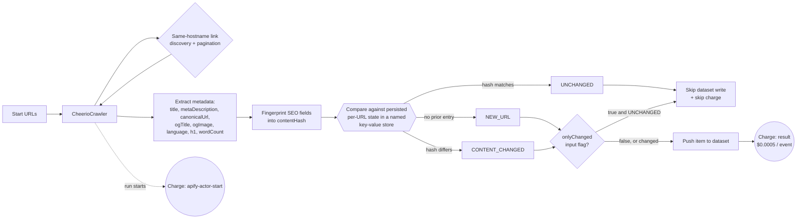

<h1 align="center">Page Metadata Extractor — SEO & RAG JSON Feed</h1>
<p align="center"><em>Clean, structured page metadata — title, meta description, canonical URL, Open Graph tags, H1, word count — for SEO audits and RAG/LLM pipelines.</em></p>

<p align="center">
  <a href="https://apify.com"></a>
  
  
  
</p>

<p align="center">
  <a href="https://apify.com/stefano_seggio/page-metadata-extractor">
    
  </a>
</p>

<p align="center">
  <sub>Owner reference (Console): <a href="https://console.apify.com/actors/U9fUBHDngX6IyjzzF">console.apify.com/actors/U9fUBHDngX6IyjzzF</a></sub>
</p>

Auditing a site's on-page SEO metadata by hand means opening every URL, viewing source, and copying the `<title>`, meta description, canonical link, Open Graph tags and `<h1>` into a spreadsheet one page at a time — then doing it all again on the next content refresh. **Page Metadata Extractor** is an SEO metadata extractor and RAG/LLM pipeline page-metadata scraper built to remove the manual part: point it at one or more start URLs and it crawls the site's same-hostname pages (and pagination, when you configure a selector) on its own, handing back a clean, typed metadata snapshot for every page it visits instead of raw HTML you'd otherwise have to fetch and parse yourself.

It serves two overlapping audiences. SEO teams get title, meta description, canonical URL and Open Graph coverage across an entire domain in one run, so missing or duplicated tags surface as rows in a dataset instead of a manual page-by-page check. RAG and LLM pipeline builders get the same crawl reduced to `{title, metaDescription, h1}` per URL plus a `wordCount` signal — fewer tokens spent on markup, no HTML parsing on the ingestion side, and a quick way to gauge a page's substance before it goes into an index.

Every request runs through Crawlee's `CheerioCrawler` with retries and session rotation already wired in, so a handful of flaky pages don't stall or skew an audit. And since a persistent per-URL content fingerprint was added, a second run against the same site tells you exactly which pages are new, which changed, and which didn't — instead of re-delivering, and re-billing, an identical crawl every time.

## Architecture



## Features

| Feature | Details |
|---|---|
| Same-hostname link discovery | Automatically follows links found on crawled pages within the same host — no sitemap or URL list needed beyond the start URLs. |
| Configurable pagination | Set `paginationSelector` (e.g. `a[rel=next]`) to follow "next page" links up to `maxPaginationDepth` pages per start URL, on top of normal link discovery. |
| Hard crawl ceiling | `maxRequestsPerCrawl` caps total pages fetched across start URLs, discovered links and pagination combined, so a run can't run away past what you asked for. |
| Retries + session rotation | `CheerioCrawler` runs with `maxRequestRetries: 4`, `retryOnBlocked: true`, and a rotating session pool with persisted cookies, so a suspected block rotates sessions instead of hammering one. |
| Failed-page error records | A page that still fails after retries is pushed to the dataset as an error item (`url`, `error`, `failedAtRetry`) instead of being silently dropped. |
| Seven-field metadata snapshot | Every successfully crawled page yields `title`, `metaDescription`, `canonicalUrl`, `ogTitle`, `ogImage`, `language`, `h1` and `wordCount`. |
| Per-URL change detection | A persisted content fingerprint classifies every page as `NEW_URL`, `CONTENT_CHANGED` or `UNCHANGED` across runs (`eventType`, `contentHash`, `previousScrapedAt`). |
| Pay-only-for-changes mode | `onlyChanged: true` still crawls every page and follows its links, but skips the dataset write — and the charge — for pages whose metadata hasn't changed since the last run. |

## Quick start

1. Have an Apify account and API token (`apify login` once, locally).
2. Run the CLI call below, or open the **Run on Apify** button above and fill in the same fields on the Console's Input tab.
3. Read the results from the run's dataset — export as JSON, CSV or Excel from Console, or pull them via the API/SDK snippets further down.

```bash
apify call page-metadata-extractor --input '{
  "startUrls": [{ "url": "https://apify.com" }],
  "maxRequestsPerCrawl": 20,
  "paginationSelector": "a[rel=next]",
  "maxPaginationDepth": 2,
  "onlyChanged": false
}'
```

`startUrls` is the only required field — everything else falls back to the defaults below.

### Input

| Field | Type | Required | Default | Description |
|---|---|---|---|---|
| `startUrls` | array | yes | `[{"url": "https://apify.com"}]` | URLs to start crawling from. At least one is required. |
| `maxRequestsPerCrawl` | integer | no | `100` | Hard cap on pages fetched this run, across start URLs, same-hostname link discovery and pagination. |
| `paginationSelector` | string | no | — | CSS selector for a "next page" link, e.g. `a[rel=next]`. When set, the crawler follows it up to `maxPaginationDepth` pages per start URL. |
| `maxPaginationDepth` | integer | no | `3` | Max paginated pages to follow per start URL. Ignored when `paginationSelector` is not set. |
| `proxyConfiguration` | object | no | Apify Proxy (datacenter) | Standard Apify proxy configuration object. |
| `onlyChanged` | boolean | no | `false` | Deliver — and get charged for — only pages that are new or whose metadata changed since the last time this Actor scraped that URL. |

## Output

One dataset item per crawled page:

```json
{
  "url": "https://apify.com/blog",
  "title": "Apify Blog",
  "metaDescription": "News, tutorials and updates from Apify.",
  "canonicalUrl": "https://apify.com/blog",
  "ogTitle": "Apify Blog",
  "ogImage": "https://apify.com/og/blog.png",
  "language": "en",
  "h1": "Apify Blog",
  "wordCount": 842,
  "statusCode": 200,
  "crawlDepth": 0,
  "scrapedAt": "2026-09-11T09:12:03.000Z",
  "eventType": "NEW_URL",
  "contentHash": "3f9a1c2b8e7d4f0a1b2c3d4e5f60718293a4b5c",
  "previousScrapedAt": null
}
```

| Field | Type | Description |
|---|---|---|
| `url` | string | The page's final (loaded) URL. |
| `title` | string | Page `<title>`. |
| `metaDescription` | string or null | `meta[name=description]` content. |
| `canonicalUrl` | string or null | `link[rel=canonical]` href. |
| `ogTitle` / `ogImage` | string or null | `og:title` / `og:image` meta content. |
| `language` | string or null | `html[lang]` attribute. |
| `h1` | string or null | Text of the first `<h1>`, if any. |
| `wordCount` | integer | Approximate visible body word count. |
| `statusCode` | integer or null | HTTP status code of the response. |
| `crawlDepth` | integer | Link-hops from the nearest start URL (0 for a start URL itself). |
| `eventType` | string | `NEW_URL`, `CONTENT_CHANGED` or `UNCHANGED` since the last scrape of this URL. |
| `contentHash` | string | Fingerprint of the extracted content, used to detect `CONTENT_CHANGED` across runs. |
| `previousScrapedAt` | string or null | Timestamp of the last scrape of this URL, or `null` if new. |

A page that fails after all retries is still recorded, as an item with `url`, `error` and `failedAtRetry` fields instead of being silently dropped.

## Pricing (Pay-Per-Event)

| Event | Price | Charged when |
|---|---|---|
| Extracted result (`result`) | **$0.0005** per event ($0.50 / 1,000 results) | Once per page whose metadata is written to the dataset. |

Failed requests that exhaust their retries are recorded as error items but are never charged, and setting `onlyChanged: true` skips both the dataset write and the charge for any page whose metadata is identical to the last time this Actor scraped it — so a scheduled re-run of an SEO audit only bills you for what's actually different this time.

## Why not just scrape it yourself?

- **Zero infrastructure.** No server, container or cron box to keep alive — the crawl runs on Apify's infrastructure and the dataset is ready to query or export the moment the run finishes.
- **No proxy or session babysitting.** Retries (`maxRequestRetries: 4`), blocked-request detection and session rotation with persisted cookies are already wired into the `CheerioCrawler` configuration, instead of you hand-rolling backoff and session management to keep a crawl alive.
- **Managed scheduling.** Point an Apify Task's schedule at this Actor and the per-URL change-detection state — kept in a dedicated key-value store, not run-local storage — just works across runs with no extra setup on your part.
- **Built-in delta detection.** `eventType`, `contentHash` and `previousScrapedAt` come out of every run for free; rolling your own means building and maintaining that fingerprinting and persistence layer before you can even start comparing runs.

## Known limitations

- **Static HTML only.** Crawling runs on Cheerio, not a browser, so pages that render their metadata client-side via JavaScript won't be extracted correctly out of the box.
- **No enumerable site registry.** The crawler follows same-hostname links and optional pagination from your start URLs — it has no concept of a site's full page list, so pages outside what's linked-to or reached within `maxRequestsPerCrawl` are never visited.
- **No formal SLA.** This Actor is built and maintained by an independent developer, not a vendor support team — there's no guaranteed uptime commitment or dedicated account manager; bug reports and feature requests go through the Issues tab on the Store listing.

## About Delta Registry

Page Metadata Extractor is part of **Delta Registry** — a portfolio of pay-per-event regulatory and compliance data infrastructure built on Apify. For professional inquiries or enterprise licensing, connect on [LinkedIn](https://www.linkedin.com/in/stefanoseggio-deltaregistry); for the rest of the fleet, see [github.com/stefanoseggio](https://github.com/stefanoseggio).
